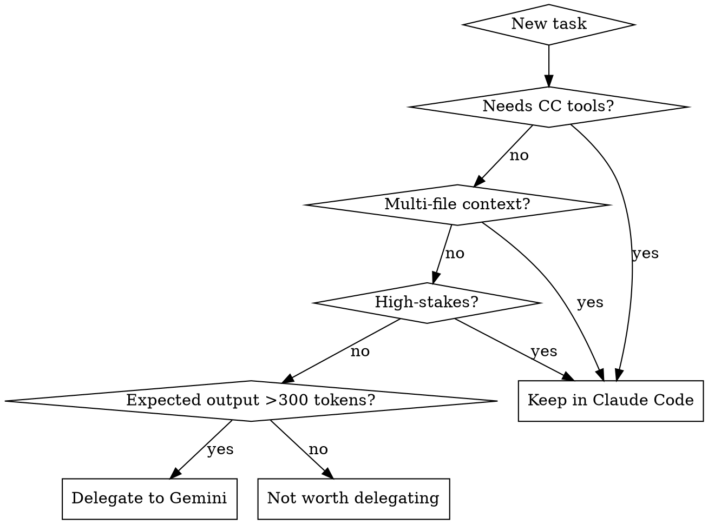

# Gemini CLI as Subagent

## Overview

Gemini CLI (`gemini -p "prompt"`) runs locally and returns results directly to stdout. Use it to offload token-expensive tasks — saving Claude Code context window and API costs.

**Core principle:** Delegate tasks where Gemini's answer is verifiable or low-risk. Keep tasks requiring multi-file reasoning or high-stakes decisions in Claude Code.

**Profitability threshold:** Delegate only when expected response >300 output tokens (~20+ lines). Smaller tasks lose savings to prompt/response overhead.

## When to Use



**Delegate to Gemini:**
- Generating boilerplate code (functions, classes, configs)
- Explaining concepts, APIs, or algorithms
- Single-file refactoring or multi-file refactoring with `-y` flag
- Writing regex, SQL queries, shell one-liners
- Translating code between languages
- Generating test data, mock fixtures, or entire test suites
- Analyzing/reading large files and documents (1M token context window)
- Reading .docx, .pdf, and other binary document formats (use `-y` for tool access)
- Writing documentation drafts
- Creating directory structures with multiple files (`-y` flag)
- Code review and bug-finding for individual files

**Keep in Claude Code:**
- Tasks needing conversation context or user preferences
- Security-critical decisions
- Multi-file architectural reasoning requiring cross-file understanding
- Tasks where you need to interact with the result iteratively

## Invocation Patterns

### Basic prompt
```bash
gemini -p "Write a Python function that converts celsius to fahrenheit. Output only code."
```

### Pipe file content for analysis (safe, no tool approval needed)
```bash
cat src/utils.ts | gemini -p "Review this code for potential bugs. Be concise."
```

### Let Gemini read files itself (-y for auto-approve)
```bash
gemini -y -p "Read sample.py in the current directory. Find all bugs and security issues."
```

### Read large/binary documents (-y required for .docx, .pdf)
```bash
gemini -y -p "Read the file report.docx. Summarize the key findings."
```

### Stdin pipe for binary documents (safer alternative to -y)
```bash
# Extract text first, then pipe — works without tool approval
python3 -c "import zipfile,re; z=zipfile.ZipFile('file.docx'); print(re.sub(r'<[^>]+>',' ',z.read('word/document.xml').decode()))" | gemini -p "Analyze this document content."
```

### Multi-file creation (-y for filesystem writes)
```bash
cd /target/dir && gemini -y -p "Read sample.py. Refactor into models/ directory with user.py, session.py, manager.py and __init__.py. Create all files."
```

### Structured output
```bash
gemini -p "Generate a JSON schema for a User object. Output only valid JSON."
```

### JSON output format (machine-readable)
```bash
gemini -o json -p "List 5 Python best practices"
```

### With model selection
```bash
gemini -m gemini-2.5-pro -p "Complex analysis task here"
```

### Background delegation (non-blocking)
Use Bash tool with `run_in_background: true` for Gemini calls while continuing other work.

## Approval Modes

| Mode | Flag | Use case |
|------|------|----------|
| Default | (none) | Prompts for each action — **not usable in `-p` mode** |
| Auto-edit | `--approval-mode auto_edit` | Auto-approve edits only |
| YOLO | `-y` | Auto-approve everything — **use for file read/write tasks** |
| Plan | `--approval-mode plan` | Read-only — safe for analysis but **cannot read binary files** |

**Important:** For `-p` (non-interactive) mode, always use `-y` when Gemini needs to read/write files. Without it, Gemini cannot get approval for tool use.

## Prompt Engineering for Gemini

**Always include output constraints** — Gemini is verbose without them:
- "Output only the code, no explanations."
- "Be concise, max N lines."
- "Return only valid JSON/YAML."
- "No markdown formatting."

**For code generation, specify:**
- Language and version
- Function signature or interface
- Edge cases to handle
- Expected input/output examples

## Integration Patterns

### Generate then Verify
```bash
RESULT=$(gemini -p "Write a bash function that checks if port is in use. Output only code.")
echo "$RESULT"  # Claude Code reviews and integrates
```

### Analyze then Act
```bash
# Gemini finds issues, Claude Code fixes them
cat problematic_file.py | gemini -p "List all bugs. One line per issue."
```

### Parallel delegation
Launch multiple Gemini tasks in parallel using multiple Bash calls with `run_in_background: true`.

### Large document analysis (1M context advantage)
```bash
# Gemini's 1M token context can handle files Claude Code would struggle with
gemini -y -p "Read the 200-page PDF manual.pdf. Extract all API endpoints mentioned."
```

## Performance Characteristics

| Metric | Value |
|--------|-------|
| Response time | 5-17 seconds |
| Context window | 1M tokens (huge files/documents) |
| Code generation | Good quality (always verify) |
| File operations | Full read/write with `-y` flag |
| Multi-file refactor | Works well with `-y` and clear instructions |
| Binary docs (.docx, .pdf) | Works with `-y`, or pipe extracted text via stdin |

## Common Mistakes

**Delegating tiny tasks:** Tasks under ~20 lines of expected output lose savings to overhead. Do them yourself.

**Forgetting `-y` for file tasks:** Without YOLO mode, Gemini in `-p` mode cannot get approval for file operations.

**Forgetting output constraints:** Without "output only code", Gemini adds verbose explanations that waste your input tokens reading the response.

**Using `--approval-mode plan` for binary files:** Plan mode can only read text files. Use `-y` for .docx/.pdf.

## Key Flags Reference

| Flag | Purpose |
|------|---------|
| `-p "prompt"` | Non-interactive single-shot mode |
| `-m model` | Select model (see model table below) |
| `-y` | Auto-approve all actions (YOLO mode) |
| `--approval-mode` | `default`, `auto_edit`, `yolo`, `plan` (read-only) |
| `-o json` | JSON output format |
| `-o stream-json` | Streaming JSON output |
| `--raw-output` | Disable output sanitization |
| `--include-directories` | Add extra directories to workspace |
| `-r latest` | Resume previous session |
| `-i "prompt"` | Run prompt then continue interactive |

## Available Models

| Model | Alias | Context | Best for |
|-------|-------|---------|----------|
| `gemini-3-flash-preview` | (default) | 1M | Fast tasks, default choice |
| `gemini-3-flash` | `3f` | 1M | Fast, stable |
| `gemini-3-pro-preview` | | 1M | Complex reasoning |
| `gemini-3-pro` | | 1M | Complex reasoning, stable |
| `gemini-2.0-flash` | | 1M | Legacy fast |
| `gemini-2.0-pro` | | 1M | Legacy complex |
| `gemini-1.5-pro` | `15p` | 1M | Legacy, proven |

**Default model is `gemini-3-flash-preview`.** Use `-m gemini-3-pro` for tasks requiring deeper reasoning. All models support 1M token context.
